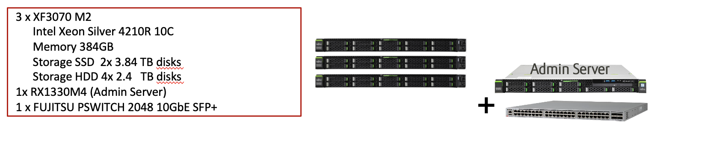
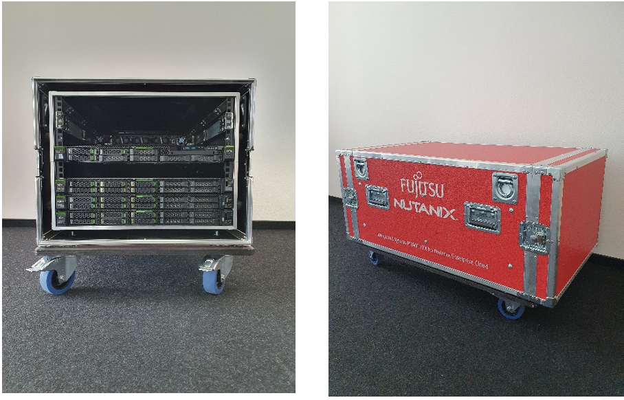

.. _clusterdetails:

------------------------
HPoC Cluster Details
------------------------

Cluster Hardware Details
++++++++++++++++++++++++

**Für den PoC wurde ein System mit 3 Nodes im rolling Rack von Fujitsu reserviert:**

.. note::
  Bedenken Sie bitte, dass diese Testumgebung zum nicht zwangsläufig  auf der neuesten Hardware basiert und das zum anderen auf Grund der Entfernung zum Lab-Datacenter entsprechende Latenzen auftreten können. Nichtsdestotrotz lassen sich mit dieser Umgebung die typischen Routineaufgaben bzgl. einer Nutanix-Cluster-Plattform mit einer ausgezeichneten User-Experience testen.

Infrastruktur IPs
+++++++++++++++++

.. list-table::
   :widths: 10 10 10 10
   :header-rows: 1

   * - Nodes
     - CVMs
     - Hypervisors
     - iRMC
   * - **Position A**
     - 172.21.124.68
     - 172.21.124.4
     - 172.21.124.132
   * - **Position B**
     - 172.21.124.69
     - 172.21.124.5
     - 172.21.124.133
   * - **Position C**
     - 172.21.124.70
     - 172.21.124.6
     - 172.21.124.134

.. list-table::
  :widths: 20 20
  :header-rows: 1

  * - Services
    - IP-Adressen
  * - **Cluster virtual IP**
    - 172.21.124.200
  * - **iSCSI Data Services IP**
    - 172.21.124.201
  * - **Prism Central**
    - 172.21.124.71
  * - **Active Directory**
    -

Zugangsdaten
++++++++++++

Die folgende Tabelle führt die standardmäßig hinterlegten Zugangsdaten für die Umgebung auf (falls andere zum Einsatz kommen sollten wird dies gesondert aufgeführt):

.. list-table::
  :widths: 20 20 10
  :header-rows: 1

  * - Name
    - Benutzername
    - Passwort
  * - **iRMC**
    - ADMIN
    - ADMIN
  * - **Prism Element Web**
    - admin
    - ItsgGsti2021!
  * - **Prism Element SSH**
    - nutanix
    - ItsgGsti2021!
  * - **Prism Central Web**
    - admin
    - ItsgGsti2021!
  * - **Prism Central SSH**
    - nutanix
    - nutanix/4u
  * - **NTNXLAB Domain**
    - NTNXLAB\\Administrator
    - ItsgGsti2021!
  * - **CentOS VM Image**
    - root
    - nutanix/4u

Netzwerk
++++++++

Die folgenden virtuellen Netzwerke wurden wie folgt vorkonfiguriert:

.. list-table::
   :widths: 33 33
   :header-rows: 1

   * -
     - **Primäres** Netzwerk
   * - **VLAN**
     - 1260
   * - **Netzwerk IP Adresse**
     - 172.21.124.0
   * - **Netzmaske**
     - 255.255.255.0 (/32)
   * - **Default Gateway**
     - 172.21.124.254
   * - **IP Address Management (IPAM)**
     - Nicht Aktiviert
   * - **DHCP Pool**
   * - **Domain**
     - itsg.local
   * - **DNS**
     - 208.67.222.222 (OpenDNS)
