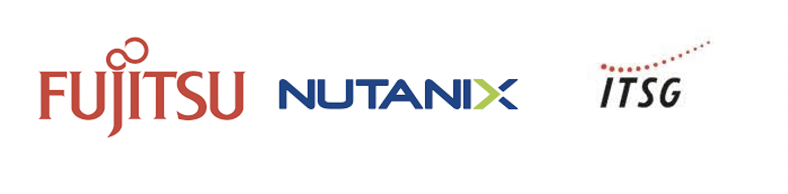

.. title:: Nutanix ITSG Privat Cloud Bootcamp

.. toctree::
   :maxdepth: 2
   :caption: Hosted PoC Infos
   :hidden:

   1-hpoc/ansprechpartner/ansprechpartner
   1-hpoc/clusterdetails/clusterdetails

.. toctree::
  :maxdepth: 2
  :caption: Nutanix AOS und AHV
  :hidden:

  aosandahv/lab_nutanix_tech_overview/lab_nutanix_tech_overview
  aosandahv/lab_storage_configuration/lab_storage_configuration
  aosandahv/lab_network_configuration/lab_network_configuration
  aosandahv/lab_deploy_workloads/lab_deploy_workloads
  aosandahv/lab_manage_workloads/lab_manage_workloads
  aosandahv/lab_data_protection/lab_data_protection

.. toctree::
  :maxdepth: 2
  :caption: Nutanix Files
  :hidden:

  files/files_deploy/files_deploy
  files/files_smb_share/files_smb_share
  files/files_nfs_export/files_nfs_export
  files/files_file_blocking/files_file_blocking
  files/files_multiprotocol/files_multiprotocol
  files/file_analytics_scan/file_analytics_scan
  files/file_analytics_anomaly/file_analytics_anomaly
  files/files_expand_cluster/files_expand_cluster

.. toctree::
  :maxdepth: 2
  :caption: Nutanix Karbon
  :hidden:

  Karbon/karbon

.. toctree::
  :maxdepth: 2
  :caption: Nutanix Objects
  :name: _objects_labs
  :hidden:

  objects/objects

.. toctree::
  :maxdepth: 2
  :caption: Nutanix Calm
  :name: _calm
  :hidden:

  what_is_calm/what_is_calm
  calm/calm_enable/calm_enable
  calm/calm_projects/calm_projects
  calm/calm_linux/calm_linux
  calm/calm_win/calm_win
  calm/calm_day2/calm_day2
  calm/calm_marketplace/calm_marketplace
  calm/calm_escript/calm_escript

.. toctree::
  :maxdepth: 2
  :caption: Optional Labs
  :name: _optional_labs
  :hidden:

.. toctree::
  :maxdepth: 2
  :caption: Appendix
  :name: _appendix
  :hidden:

  appendix/glossary
  tools_vms/windows_tools_vm
  tools_vms/linux_tools_vm

.. _getting_started:

----------------------------------------------
Herzlich willkommen auf dem Nutanix ITSG Privat Cloud PoC
----------------------------------------------

Diese Nutanix PoC Webseite führt Sie Schritt für Schritt durch die verschiedenen Labs, sodass Sie eine umfassende praktische Einführung in die Nutanix Technologie erhalten.

In diesem Bootcamp lernen Sie Prism Element, dessen Funktionen und Navigation kennen. Sie werden Prism verwenden, um grundlegende Clusterverwaltungsaufgaben auszuführen, einschließlich Speicher und Netzwerk. Sie werden auch grundlegende Aufgaben zur Bereitstellung und Verwaltung von VMs mit Prism und AHV ausführen. Schließlich werden sie den VM-Protection untersuchen, einschließlich Snapshots und Replikation. Am Ende des Bootcamps sollten Sie die Kernkonzepte und -technologien des Nutanix Enterprise Cloud-Stacks theoretisch und praktisch erlebt haben.

**In den Labs werden primär folgende Nutanix Produkte verwendet:**

- AOS
- AHV
- Prism
- Files
- Karbon
- Objects
- Calm

**Haben wir Ihr Interesse geweckt? Dann lassen Sie uns beginnen!**
